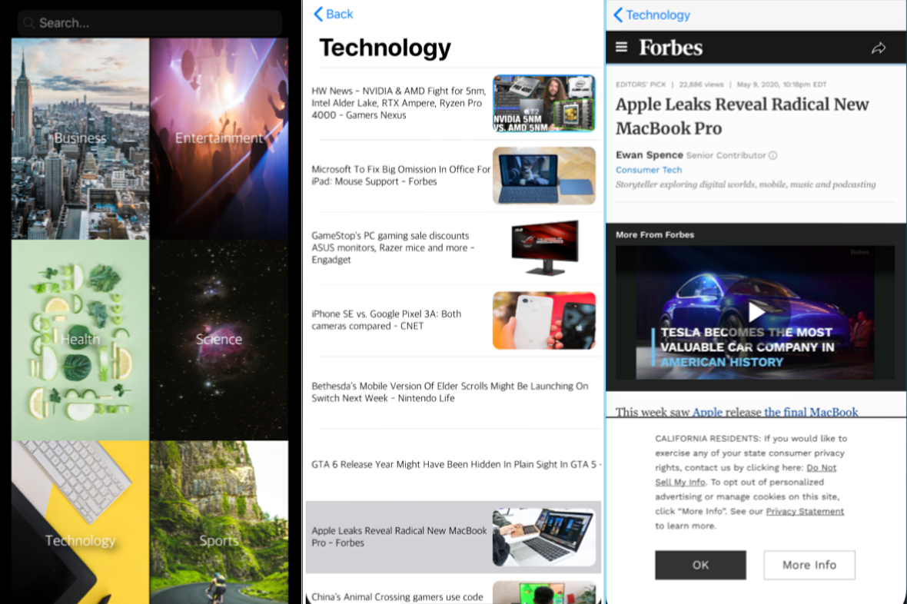

# Newsstand

Newsstand is an iOS app that fetches top articles from recent news and displays them as clickable items that will take you to the full story.

## Getting Started

Note: Newsstand is still in the process of developmemt.

In order to preview this app, you will need to clone this repository and open it in Xcode
 - If you do not have Xcode you can download it [here](https://developer.apple.com/xcode/)

## Built With

* [Swift](https://swift.org/documentation/) - Language 
* [Xcode](https://developer.apple.com/xcode/) - IDE
* [News API](https://newsapi.org/) - API

