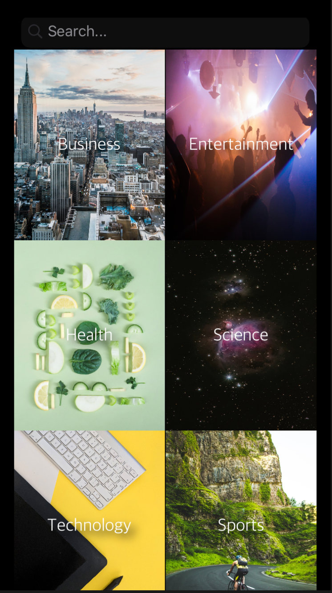
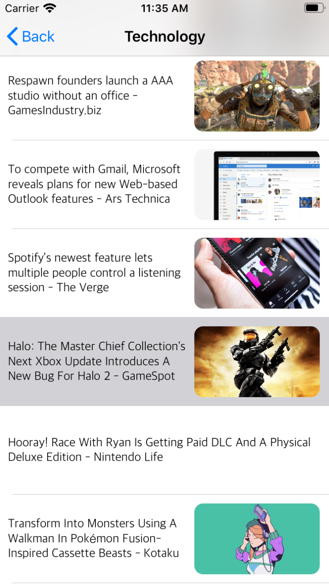
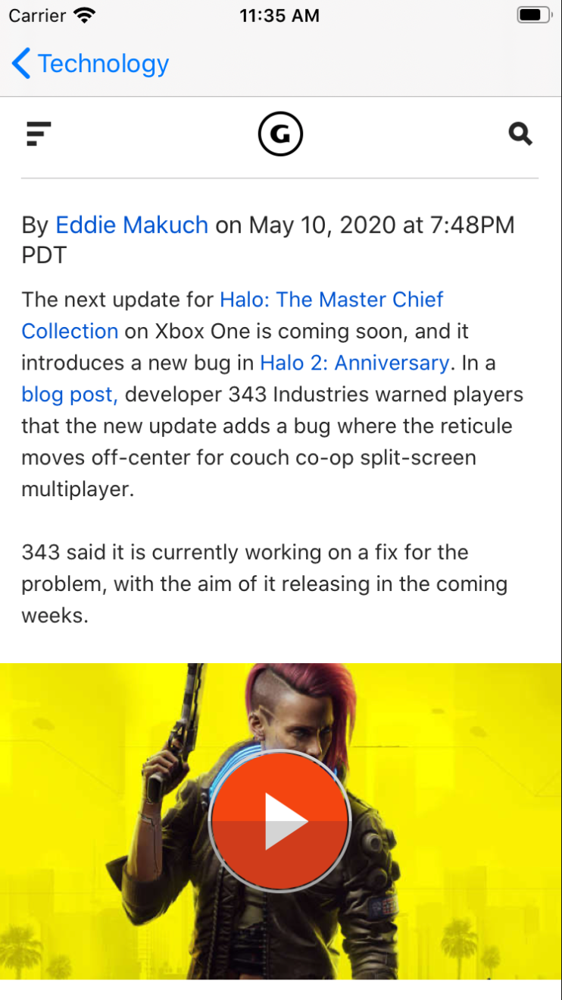

# Newsstand

Newsstand is an iOS app that fetches top articles from recent news and displays them in a simple and minimalistic view. Users are able to read their choice of articles while staying on the app and gain access to stories they may initially have need a subscription to in order to access the article. 

## Previews

### Home Screen
Choose the category of news one would like to read more from in Newsstands scrollview

  


### Articles Screen 
See the top trending articles from the category of choice 



### Article Details Screen 

Read the article of choice in the web view without ever having to leave the app! Be able to save your article to read later or share it to your friends, families, and others via text, social media, or link share!



## Getting Started

Note: Newsstand is still in the process of developmemt.

In order to preview this app, you will need to clone this repository and open it in Xcode
 - If you do not have Xcode you can download it [here](https://developer.apple.com/xcode/)
 
### Example of Coding Style 
Making a request to News API to fetch articles based on the category a user chooses
```swift
    func getArticles(category: String, _ completion: @escaping (Result<[Article]>) -> Void) {
        let articlesRequest = makeRequest(for: .category(category: category))
        print("\(articlesRequest)")
        let task = urlSession.dataTask(with: articlesRequest) { data, response, error in
            // Check for errors.
            if let error = error {
                return completion(Result.failure(error))
            }
            
            // Check to see if there is any data that was retrieved.
            guard let data = data else {
                return completion(Result.failure(EndPointError.noData))
            }
            
            do{
                let jsonObject = try JSONSerialization.jsonObject(with: data, options: [])
                print(jsonObject)
            } catch {
                print(error.localizedDescription)
            }
            
            // Attempt to decode the data.
            guard let result = try? JSONDecoder().decode(ArticleList.self, from: data) else {
                
                return completion(Result.failure(EndPointError.couldNotParse))
            }
            
            let articles = result.articles
            
            // Return the result with the completion handler.
            DispatchQueue.main.async {
                completion(Result.success(articles))
            }
        }
        
        task.resume()
    }

```

## Built With

* [Swift](https://swift.org/documentation/) - Language 
* [Xcode](https://developer.apple.com/xcode/) - IDE
* [News API](https://newsapi.org/) - API

