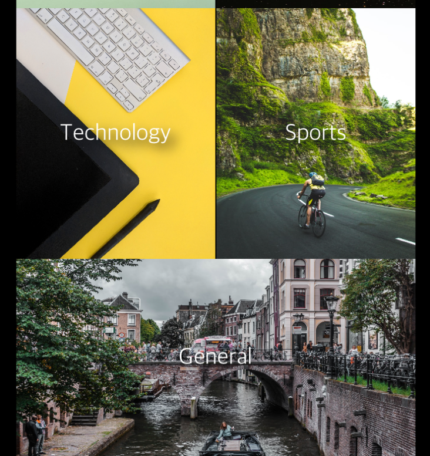

# Newsstand

Newsstand is an iOS app that fetches top articles from recent news and displays them as clickable items that will take you to the full story. 

## Previews

### Home Screen
Choose the category of news you would like to read more from in Newsstands scrollview

  

### Articles Screen 
See the top trending articles from the category of your choice 

### Article Details Screen 

Read the article of your choice in the web view without ever having to leave the app! Be able to save your article to read later or share it to your friends, families, and others!

 

## Getting Started

Note: Newsstand is still in the process of developmemt.

In order to preview this app, you will need to clone this repository and open it in Xcode
 - If you do not have Xcode you can download it [here](https://developer.apple.com/xcode/)

## Built With

* [Swift](https://swift.org/documentation/) - Language 
* [Xcode](https://developer.apple.com/xcode/) - IDE
* [News API](https://newsapi.org/) - API

